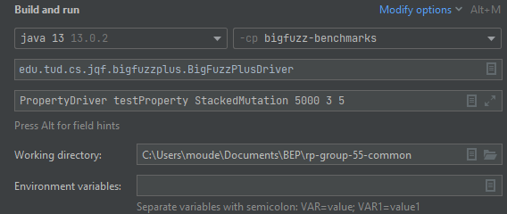

# BigFuzzPlus: Fuzz tester for Big Data Applications
Welcome to this shared repository. This repository has been created for the Bachelor research project in Computer Science and Engeneering at the Technical University of Delft.

The developers of this repository are:
- Bo van den Berg
- Lars van Koetsveld van Ankeren
- Melchior Oudemans
- Lars Rhijnsburger
- Martijn Smits

On this repository, a new method is implemented: BigFuzzPlus. This method builds on the implementation found in the BigFuzz repository (https://github.com/qianzhanghk/BigFuzz/).

New functionalities added are:
- Tabular input specification 
- JSON input specification
- (Boosted) Coverage-guided fuzzing 
- Systematic mutations for fuzzing
- Stacking of mutation 

The papers describing the implemented methods can be found in the "TODO" directory on this repository. How to use these functionalities are described below.

# Overview
The following items will be explained:
- Drivers
- Program Arguments
- Implementation specific details
- modules

# How to run BigFuzzPlus
## config
If you want to run a benchmark, you can provide an initial file seed. This seed can be any random file. To use that file, enter the file location in the dataset/conf file.
> Example:  
> conf= ./dataset/movierating.csv  
> movierating.csv= ASTAR:_2,_3
## Drivers
After cloning the repository, the maven will install all modules and import all dependencies.
Below is a list of which driver you need to run per implementation:

| Implementation | Driver |
| --- | ----------- |
|tabular input specification|TabFuzzDriver|
|JSON input specification|BigFuzzDriver*|
|Coverage guided fuzzing|BigFuzzPlusDriver|
|Systematic mutations for fuzzing|BigFuzzPlusDriver|
|Stacking of mutation|BigFuzzPlusDriver|

* BigFuzzPlusDriver also works, but made to run on BigFuzzDriver. 
## BigFuzzPlusDriver
Independent of which implementation is used, the first 4 program arguments are:  
> [0] - test class                                           
> [1] - test method                                          
> [2] - mutation method                     
> [3] - max Trials                (default = Long.MAXVALUE)

The test class is the Benchmark class name, and the test method is the method inside said class. If the class/method does not exist, the program will cause an error.  
Existing benchmarks can be found in either the "Benchmarks" (module: bigfuzz-benchmarks) or "customarray" (module: bigfuzz-dfcoverage) directories. To use one of these benchmarks, the corresponding module needs to be passed in the run configurations.  

The mutation method needs to be an existing mutation method and has to be added to the BigFuzzPlusGuidance class.   
> (e.g. StackedMutation / SystematicMutation / FindSalaryMutation/ ....)
 
To Change the input selection, change SelectionMethod to:
> - FULLY_BOOSTED_GREY_BOX (=default, 100% favored, coverage files)
> - HALF_BOOSTED_GREY_BOX (50% favored, coverage files)
> - GREY_BOX (0% favored, coverage files)
> - BLACK_BOX (0% favored, initial files)

If run with StackedMutation as the mutation method:  
> [4] - stacked mutation method   (default = 0)  
> - 0 = Disabled  
> - 1 = Permute_random (permute between 1 and the max amount of mutations)  
> - 2 = Permute_max (Always permute until the max amount of mutations)  
> - 3 = Smart_stack (Apply higher-order mutation exclusion rules)  
> - 4 = Single mutate (Only apply 1 mutation per column)
>
>[5] - max mutation stack        (default = 2)  
  
If run with SystematicMutation as mutation method:   
>[4] - mutate columns            (default = disabled)  
>[5] - max mutation depth        (default = 6)  

If run with JsonMutation as mutation method: (Although advised to run with BigFuzzDriver instead of BigFuzzPlusDriver)
> [2] = JsonMutation 

Make sure to make the conf file reference to an initial input file that is a json file (e.g. dataset/movierating.json) and make sure there is also a schema for that input file (e.g. movierating_schema.json). The name of the schema file should be exactly [benchmark]_schema.json.

Example of a StackedMutation run configuration:             

Example of a JsonMutation run configuration for the BigFuzzPlusDriver:

## BigFuzzDriver
For the Json variant, it is best to run with the BigFuzzDriver since the extension is made for this driver.

The arguments for a run with this driver are:
> [0] - test class                                           
> [1] - test method                                          
> [2] - Amount of trials

There should also be a conf file inside the dataset folder, pointing to a file with the initial input seed.
To run the BigFuzzDriver with a program that uses Json as its in-/output structure, make sure that the conf file 
points to a Json file (e.g. dataset/movierating.json) and make sure there is also a schema for that input file 
(e.g. movierating_schema.json). The name of the schema file should be exactly [benchmark]_schema.json.

The output of these runs can be found in the folder called output which will be automatically created if not present already.

Example of a JsonMutation run configuration for the BigFuzzDriver:

## TabFuzzDriver
  

# Modules
### bigfuzz-benchmarks (dir: Benchmarks)
Contains the benchmarks from bigfuzz which have been used in the code coverage results for their paper.
### bigfuzz-old-customarray (dir: big_fuzz_customarray)
Contains the benchmarks from bigfuzz repository
### bigfuzz-dfcoverage (dir: customarray)
Contains the benchmarks which have been modified to work with direct inputs, rather than a reference to the inputs.
### jqf-examples (dir: examples)
Not used.
### bigfuzz-guidance (dir: fuzz)
Contains the BigTest, BigFuzz and BigFuzzPlus drivers.
### jqf-instrument (dir: instrument)
Contains code that is used by the JQF engine.
### jqf-maven-plugin (dir: maven-plugin)
Contains the maven project setup for JQF.
### transformer (dir: transformer)
Contains the code used to transform a Spark program to a java program. However, the program requires UDF generator/specifications and does not transform properly in this repository.
